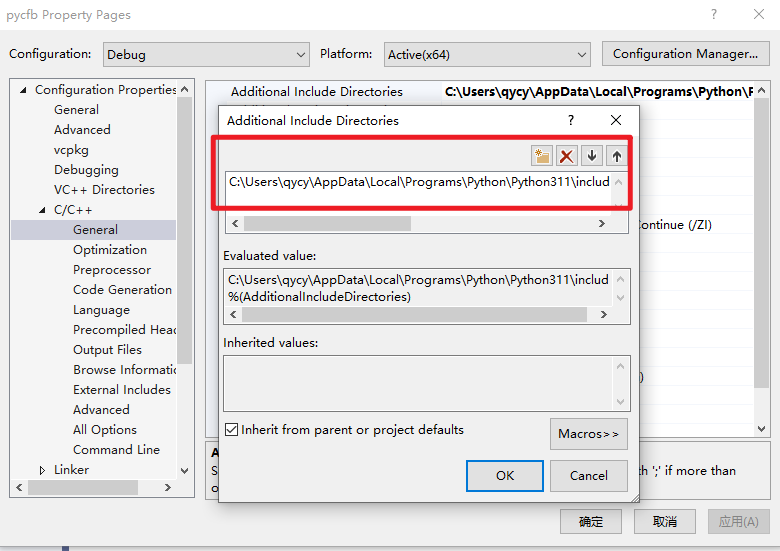
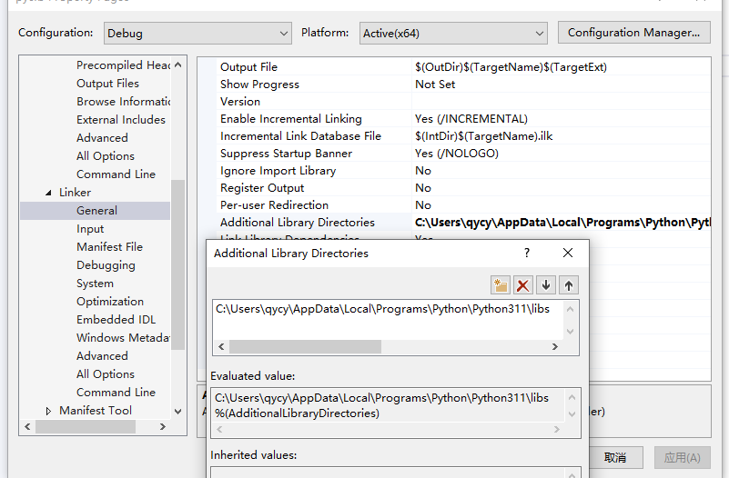

# pycfb
> Add Microsoft Compound File Binary File Format support to Python

You need to install `pybind11`(e.g. by [vcpkg](https://github.com/microsoft/vcpkg)) and change these two options to compile.

Make sure to use `Release` configuration for compiling.

Check `test.py` for usage.